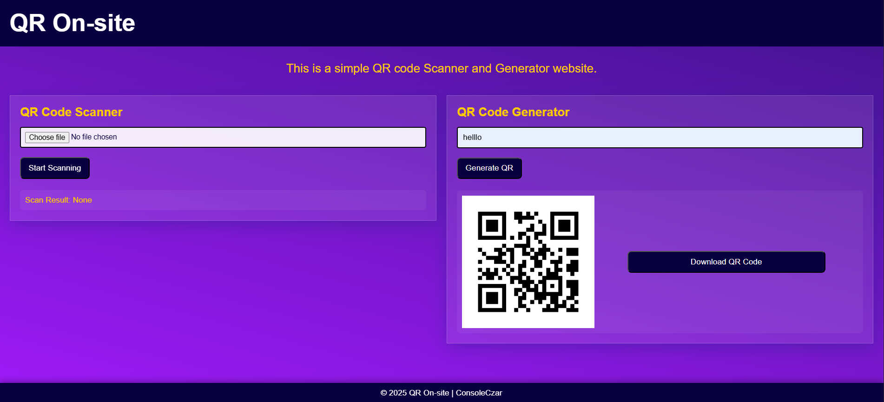

# QR On-Site

<a href="https://winter-of-open-source.vercel.app/"></a>

[](https://developer.mozilla.org/en-US/docs/Web/HTML) [](https://developer.mozilla.org/en-US/docs/Web/CSS) [](https://developer.mozilla.org/en-US/docs/Web/JavaScript) <a href="https://gdg.community.dev/gdg-on-campus-indian-institute-of-engineering-science-and-technology-shibpur-howrah-india/"></a> <a href="https://www.codeiiest.in/"></a> [](https://winter-of-open-source.vercel.app/)

**QR On-Site** is a web-based QR Code Scanner and Generator built from scratch without external QR libraries.

This project is part of **IIEST, Shibpur's** **[Winter of Open Source](https://winter-of-open-source.vercel.app/)**, where contributors learn to implement QR code encoding/decoding algorithms from the ground up, understand error correction, and build a fully functional QR code tool.

## Web Interface

<!-- Add your screenshots here -->
<p align="center">
  
  <!--  -->
</p>


## Current Status

| Feature | Status | Details |
|---------|--------|---------|
| **QR Generator** | 🟡 Partial | Version 2, Medium error correction only (hardcoded) |
| **QR Scanner** | 🔴 Placeholder | UI exists, logic needs to be implemented |
<!-- | **Responsive UI** | 🟢 Complete | Works on desktop and mobile | -->

### What Needs To Be Done

**Generator Improvements:**
- [ ] Support for multiple QR versions (currently only Version 2)
- [ ] Configurable error correction levels (L, M, Q, H)
- [ ] Dynamic version selection based on data length
- [ ] Support for different encoding modes (numeric, alphanumeric, byte, kanji)

**Scanner Implementation:**
- [ ] Image processing to detect QR codes
- [ ] Finder pattern detection algorithm
- [ ] Perspective correction for tilted QR codes
- [ ] Data extraction and decoding logic
- [ ] Error correction decoding (Reed-Solomon)

## Features

- **QR Code Scanner** - Upload images to decode QR codes *(needs implementation)*
- **QR Code Generator** - Create QR codes from text input *(Version 2-M only)*
- **No External Libraries** - Built from scratch for learning
- **Responsive Design** - Works on desktop and mobile

## Demo

Visit the live demo: [QR On-Site](https://qr-on-site.vercel.app)

## Installation

```bash
git clone https://github.com/ConsoleCzar-2/qr-on-site.git
cd qr-on-site

# Open directly in browser
# Just open index.html in your browser

# Or use a local server (recommended)
python -m http.server 8000
# Then visit http://localhost:8000
```

## How to Contribute

We need contributors to help complete this project! Check out [CONTRIBUTING.md](CONTRIBUTING.md) for:
- Learning resources (10-part QR code tutorial series)
- Setup instructions
- Contribution guidelines and points system

Browse [Open Issues](https://github.com/ConsoleCzar-2/qr-on-site/issues) to find tasks labeled by difficulty and component.

> [!IMPORTANT]
> **Do NOT use external QR libraries.** The goal is to implement everything from scratch!

## Code of Conduct

Please follow [CODE_OF_CONDUCT.md](CODE_OF_CONDUCT.md) to ensure a welcoming and productive environment for all contributors.

---

<p align="center">
Made with ❤️ by <a href="https://github.com/ConsoleCzar-2">ConsoleCzar</a>
</p>
